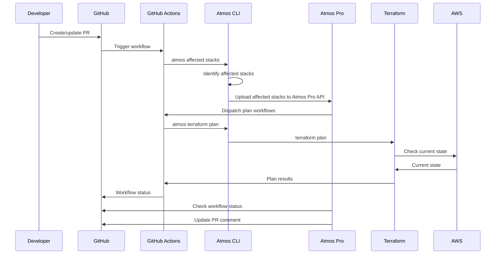
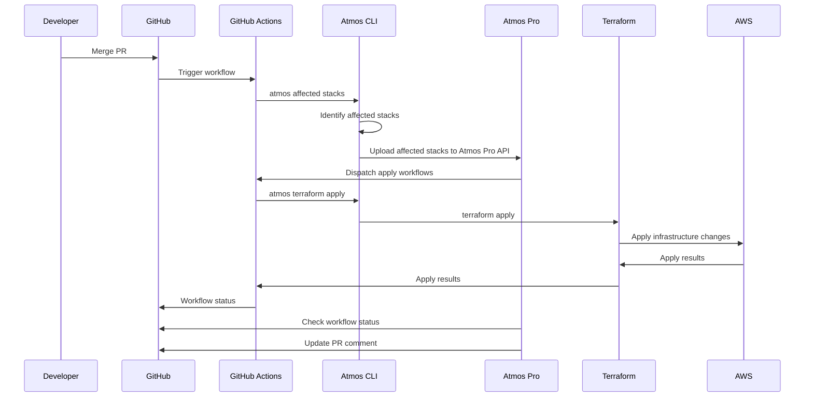

# atmos-pro-example-advanced

An advanced example demonstrating how to use Atmos Pro with GitHub Actions for infrastructure deployment. This
repository shows a comprehensive setup with multiple components and dependencies, showcasing how Atmos Pro handles
complex infrastructure workflows.

## Introduction

This is an advanced example repository that demonstrates how to use Atmos Pro with GitHub Actions for infrastructure
deployment. It provides a comprehensive setup with multiple components and dependencies to showcase how Atmos Pro
handles complex infrastructure workflows.

For comprehensive documentation and advanced features, visit [atmos-pro.com/docs](https://atmos-pro.com/docs).

## Usage

### Installation

<details>
<summary><strong>Prerequisites for Using Atmos CLI</strong></summary>

In order to trigger workflows from this GitHub repository, the Atmos Pro GitHub App will execute `atmos` on your behalf
in GitHub Actions. You do not need to install anything locally.

However if you wish to execute `atmos` locally, you will need to install Atmos. For installation instructions, visit the
[Atmos installation guide](https://atmos.tools/install).

</details>

<details>
<summary><strong>Prerequisites for Using Atmos Pro (Advanced Example)</strong></summary>

The following prerequisites are **not required** to run this demo example but are essential for using **Atmos Pro**
effectively with real infrastructure:

#### 1. GitHub OIDC Integration

To use GitHub Actions securely with Terraform, you'll need to set up **GitHub OIDC** with your cloud provider of choice.

> ⚠️ This example works without GitHub OIDC, but you'll need it in practice for GitHub Actions to authenticate properly
> with your cloud provider.

For more on setting this up with our reference architecture, please see
[How to use GitHub OIDC with AWS](https://docs.cloudposse.com/layers/github-actions/github-oidc-with-aws/).

#### 2. Terraform Plan Storage Backend

This example has plan storage **disabled** for simplicity. However, we recommend enabling it once the basics are
working.

- Atmos Pro supports plan storage on **AWS**, **GCP**, and **Azure**.
- Plan storage lets you reuse the `.tfplan` file generated during the `plan` phase in the `apply` phase—this is a
  Terraform best practice.

For more on setting this up with our reference architecture, please see
[Setup GitOps with GitHub Actions](https://docs.cloudposse.com/layers/gitops/setup/).

#### 3. Terraform State Backend

The example uses a **local state backend**, which is fine for demos without real cloud resources.

- In production, you should configure a **remote state backend**.
- Cloud Posse provides a reusable component for AWS. For GCP, Azure, etc., use your preferred backend configuration.

For more on setting this up with our reference architecture, please see
[](https://docs.cloudposse.com/layers/accounts/initialize-tfstate/).

</details>

### Quick Start

Follow these steps to get started with this Atmos Pro example:

1. **Fork this repository**

   - Click the "Fork" button in the top right corner of this repository on GitHub

2. **Install the Atmos Pro GitHub App**

   - Follow the [Atmos Pro documentation](https://atmos-pro.com/docs) to sign up for Atmos Pro and install the GitHub
     App in your forked repository.

3. **Set up GitHub Variables**

   - `ATMOS_PRO_WORKSPACE_ID` - Your Atmos Pro workspace ID.
     [Find your workspace ID](https://atmos-pro.com/docs/configure/workspaces).
   - `ATMOS_VERSION` - The version of Atmos to use (e.g., `1.181.0`)
   - `ATMOS_CONFIG_PATH` - Path to your Atmos configuration file (e.g., `atmos.yaml`)

   For more information about GitHub variables, see the
   [GitHub documentation](https://docs.github.com/en/actions/how-tos/writing-workflows/choosing-what-your-workflow-does/store-information-in-variables).

Now to test it out, create a pull request and let Atmos Pro do the rest!

For example, you can modify an example component in `stacks/orgs/ex1/plat/dev/us-east-2/demo.yaml` and create a pull
request on GitHub to trigger the Atmos Pro workflows. Try changing the value of `foo`, sit back, and see what happens!

### How it works

This example demonstrates a comprehensive configuration for using Atmos Pro with GitHub Actions. The workflow follows
these steps:

<details>
<summary><strong>On Pull Requests</strong></summary>

When a pull request is created or updated, Atmos Pro triggers
[`atmos terraform plan`](.github/workflows/atmos-terraform-plan.yaml):

1. **Developer makes a change** - You modify your infrastructure code
2. **Code is pushed to feature branch** - Changes are committed and pushed
3. **GitHub Actions trigger Atmos affected stacks** - Atmos identifies which stacks are affected by your changes
4. **Atmos uploads affected stacks** - The affected stack configurations are uploaded to Atmos Pro
5. **Atmos Pro dispatches plan workflows** - Atmos Pro automatically runs `atmos terraform plan` for affected components
6. **Atmos Pro updates status comment** - Results are posted as a comment on your pull request

This gives you visibility into what changes will be made to your infrastructure before merging.



</details>

<details>
<summary><strong>On Merged Pull Requests</strong></summary>

When a pull request is merged, Atmos Pro triggers
[`atmos terraform apply`](.github/workflows/atmos-terraform-apply.yaml):

1. **Pull request is merged** - Your changes are merged into the main branch
2. **GitHub Actions trigger Atmos affected stacks** - Atmos identifies which stacks need to be updated
3. **Atmos uploads affected stacks** - The affected stack configurations are uploaded to Atmos Pro
4. **Atmos Pro dispatches apply workflows** - Atmos Pro automatically runs `atmos terraform apply` for affected
   components
5. **Atmos Pro updates status comment** - Deployment results are posted as a comment on the merged PR

This ensures your infrastructure changes are automatically deployed when code is merged.



</details>

For more detailed configuration options and advanced features, refer to the
[Atmos Pro documentation](https://atmos-pro.com/docs).

### Building Documentation

To build the documentation for this repository, run:

```bash
atmos docs generate readme
```

This command generates the README.md file from the README.yaml configuration.

### Repository Structure

```
.
├── .github/
│   ├── README.md              # Generated README for GitHub
│   ├── README.md.gotmpl       # Template for README generation
│   └── workflows/             # GitHub Actions workflows
│       ├── atmos-pro.yaml     # Main Atmos Pro workflow
│       ├── atmos-terraform-apply.yaml
│       ├── atmos-terraform-plan.yaml
│       └── atmos-validate.yaml
├── README.yaml                # Main documentation source
├── atmos.yaml                 # Atmos configuration
├── components/                # Infrastructure components
│   └── terraform/
│       ├── account-map/       # Account mapping component
│       ├── api/               # API component
│       ├── cache/             # Cache component
│       ├── cdn/               # CDN component
│       ├── cluster/           # Cluster component
│       ├── database/          # Database component
│       ├── dynamodb/          # DynamoDB component
│       ├── frontend/          # Frontend component
│       ├── github-oidc-provider/ # GitHub OIDC provider
│       ├── github-oidc-role/  # GitHub OIDC role
│       ├── load-balancer/     # Load balancer component
│       ├── object-storage/    # Object storage component
│       ├── s3-bucket/         # S3 bucket component
│       └── vpc/               # VPC component
└── stacks/                    # Atmos stack configurations
    ├── catalog/               # Component catalog
    ├── mixins/                # Stack mixins
    ├── orgs/                  # Organization stacks
    │   └── ex1/               # Example organization
    │       ├── core/          # Core infrastructure
    │       └── plat/          # Platform infrastructure
    ├── schemas/               # Validation schemas
    └── workflows/             # Workflow definitions
```

## License

<a href="https://opensource.org/licenses/Apache-2.0"></a>

<details>
<summary>Preamble to the Apache License, Version 2.0</summary>
<br/>
<br/>

```text
Licensed to the Apache Software Foundation (ASF) under one
or more contributor license agreements.  See the NOTICE file
distributed with this work for additional information
regarding copyright ownership.  The ASF licenses this file
to you under the Apache License, Version 2.0 (the
"License"); you may not use this file except in compliance
with the License.  You may obtain a copy of the License at

  https://www.apache.org/licenses/LICENSE-2.0

Unless required by applicable law or agreed to in writing,
software distributed under the License is distributed on an
"AS IS" BASIS, WITHOUT WARRANTIES OR CONDITIONS OF ANY
KIND, either express or implied.  See the License for the
specific language governing permissions and limitations
under the License.
```

</details>

---

Copyright © 2017-2025 [Cloud Posse, LLC](https://cpco.io/copyright)
