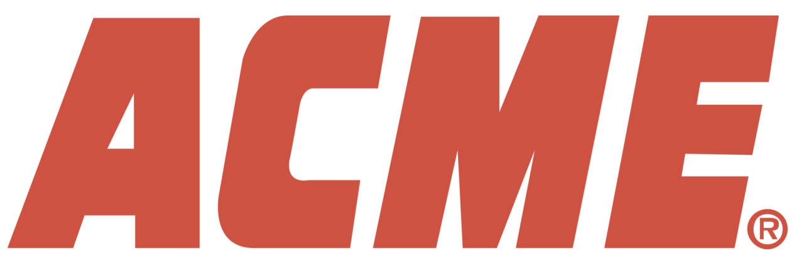

<p align="center">
  
  <h3 align="center">Cloud Infrastructure</h3>
</p>

<p align="center">
  <i>This repository defines the atmos infrastructure developed with <a href="https://cloudposse.com/">Cloud Posse</a> in 0000-00-00.</i>
</p>

<p align="center">
  <a href="https://cloudposse-examples.slack.com/"></a>
  <a href="https://cpco.io/slack?utm_source=github&utm_medium=readme&utm_campaign=cloudposse-examples/infra-demo-atmos-pro&utm_content=slack"></a>
  <a href="https://github.com/cloudposse-examples/infra-demo-atmos-pro/actions/workflows/atmos-terraform-apply.yaml"></a>
  <a href="https://github.com/cloudposse-examples/infra-demo-atmos-pro/actions/workflows/atmos-terraform-drift-detection.yaml"></a>
</p>

<p align="center">
  <a href="https://atmos-corp-prod.cloud">Home</a>
  - <a href="https://docs.cloudposse.com/reference-architecture/">Docs</a>
  - <a href="./docs/adr">ADRs</a>
  - <a href="https://app.datadoghq.com">Datadog</a>
</p>

## Core Concepts

- [Terraform](https://docs.cloudposse.com/fundamentals/terraform/) is an
  [infrastructure as code](https://en.wikipedia.org/wiki/Infrastructure_as_code) tool that lets you build, change, and
  version cloud and on-prem resources safely and efficiently.
- [Atmos](https://atmos.tools/) is a workflow automation tool for DevOps that makes it more manageable to operate very
  large environments with DRY configuration.
- [Geodesic](https://docs.cloudposse.com/fundamentals/geodesic/) is a DevOps Linux Toolbox in Docker. We use it as an
  interactive cloud automation shell. It's the fastest way to get up and running with a rock solid Open Source
  toolchain.
- [Stacks](https://docs.cloudposse.com/fundamentals/stacks/) are a way to express the complete infrastructure needed for
  an environment. Think of a Stack as an architectural "Blueprint" composed of one or more Components and defined using
  a standardized YAML configuration.
- [Components](https://docs.cloudposse.com/components/) are opinionated, self-contained building blocks of
  Infrastructure-as-Code (IAC) that solve one specific problem or use-case. Components are organized by toolchain (E.g.
  `terraform`). Atmos supports multiple different toolchains and has native integration with tools like Terraform and
  Helmfile. In the case of Terraform, think of components as
  ["root modules"](https://developer.hashicorp.com/terraform/language/modules#the-root-module).
- [Leapp](https://www.leapp.cloud/) is a Desktop Dev Tool that handles the management and security of your cloud
  credentials for you so you can log into any AWS account with the click of a button using your native OS keychain.
  Please see [How to Log into AWS](./docs/how-to-log-into-aws.md) for details on settings up Leapp locally.

## Quick Start

Baseline prerequisites for your host computer:

- [ ] Docker installed and running
- [ ] `make` installed, preferably GNU Make
- [ ] `git` installed

Make sure you've also installed local dependencies and precommit hooks.

<details>
  <summary>Install on MacOS</summary>

Before running any `brew` command, first install [Homebrew](https://brew.sh/). Once `brew` is installed locally, run the
following command to install all requirements with Homebrew.

```console
brew bundle install
```

</details>

<details>
  <summary>How to Build Locally</summary>

1. Sign into Leapp
2. Build and run Geodesic

```bash
make all
```

3. Verify authorization is setup properly by running `assume-role`:

```bash
assume-role                        # see all roles you can jump to interactively
assume-role atmos-plat-gbl-dev-admin # jump into a role to run commands against
```

You will also want to make sure your VPN is setup as this will allow you to connect to our live Kubernetes clusters with
`kubectl` inside of Geodesic.

1. Download the [AWS Client VPN](https://docs.aws.amazon.com/vpn/latest/clientvpn-user/client-vpn-connect-macos.html).
2. Once open, go to the "Manage Profiles" settings view and add a profile. Use the configuration file in
   `rootfs/etc/vpn/core-use1-network.ovpn`.
3. Hit connect! Connecting should take you to our SSO provider for sign in. If all was successful you should be good to
   go!

Verify this is working by setting your active cluster and listing out running pods and switching between namespaces:

```bash
set-cluster core-use1-auto    # This cluster holds all our pods running CI/CD infrastructure.
kubectl get pods -A
kubens echo
kubectl get pods -A
kubens default
kubectl get pods -A

set-cluster plat-use1-dev # This cluster is our live dev environment
kubectl get deployments -A
```

</details>

## Usage

### Makefile

- `make all`: Build and run the Geodesic shell
- `make run`: Start the Geodesic shell by calling wrapper script
- `make build`: Build docker image
- `make build-clean`: Build docker image with no cache
- `make terraform-rm-lockfiles`: Remove all lock files
- `make rebuild-docs`: Rebuild README for all Terraform components using pre-commit
- `make rebuild-adr-docs`: Rebuild README TOC for all ADRs

### Atmos

The [`atmos`](https://atmos.tools) is a universal tool for DevOps and cloud automation, it allows deploying and
destroying Terraform and helmfile components, as well as running workflows to bootstrap or teardown all resources in an
account. Below are the most common commands, but you can find the complete list of commands and latest documentation at
[atmos.tools](https://atmos.tools).

> [!NOTE]
>
> Atmos is configured with the [`atmos.yaml`](https://atmos.tools/cli/configuration), which is located in
> [rootfs/usr/local/etc/atmos/atmos.yaml](./rootfs/usr/local/etc/atmos/atmos.yaml).

#### `atmos terraform`

Execute terraform commands

```console
atmos terraform <command> <component> -s <stack> [options]
atmos terraform <command> <component> --stack <stack> [options]
```

#### `atmos describe`

Describe the complete configuration for an Atmos component in an Atmos stack

```console
atmos describe component <component> -s <stack>
```

Show the fully deep-merged configuration for all stacks and the components in the stacks

```console
atmos describe stacks [options]
```

Show a list of Atmos components in Atmos stacks that depend on the provided Atmos component

```console
atmos describe dependents <component> -s <stack>
```

Show a list of the affected Atmos components and stacks given two Git commits.

```console
atmos describe affected
```

### Geodesic

[Geodesic](https://docs.cloudposse.com/tutorials/geodesic-getting-started/) is a cloud automation shell. It's the
fastest way to get up and running with a rock solid, production grade cloud platform built on top of strictly Open
Source tools.

Cloud Posse tools expect to be run with a current version of `bash`, which if on MacOS should be installed via `brew` as
the one distributed by Apple is very outdated. A current version of `sh` or `zsh` is likely to work as well but may run
into occasional problems as they have not been subjected to the same level of testing as with `bash`.

<details>
  <summary>Using ARM-based Architecture (Mac M series)</summary>

If using an ARM based architecture like Mac M1 or M2 (or etc) add the following env var to your profile

```console
export PATH=$HOME/.local/bin:$PATH
```

This is only necessary if you do not have permission to write to `/usr/local/bin`.

You can verify whether or not you have permission to write to `/usr/local/bin` with a simple test file. i.e.
`touch /usr/local/bin/writetestfile && rm -f /usr/local/bin/writetestfile`

For all architectures run this to build Geodesic binary equal to the `APP_NAME` in the `Makefile`.

</details>

Build the Geodesic with the following:

```console
make all
```

> [!NOTE]
>
> The `sudo` command should not be needed. This should install the Geodesic binary to `/usr/local/bin` on non-M1 and to
> `~/.local/bin` on M1.

Once inside the shell, `/localhost` refers to the user's `$HOME` on the host machine which is added as a symbolic link
to `/localhost`, so absolute paths on the host, for example `/Users/fred/Documents`, will also work inside the shell, as
long as they refer to files and directories under `$HOME`. Navigate to `/localhost` as you would `~/` to access the
files as represented on the host machine; this is useful for development.

It is a good practice to rebuild the image when starting a new branch from `main` where package updates could have
occurred.

Once the image is built locally, the shell can be started without building again by running:

```console
make run
```

or

```console
atmos
```

<details>
  <summary>Creating Preferences</summary>

Create a Geodesic preferences directory of scripts that will be auto loaded upon the start of the container.

```console
mkdir -p ~/.geodesic/preferences.d
```

Add an `init.sh` file. This file can be named anything. Here is an example.

```console
### kubectl
alias k="kubectl"

### enable removing commands from history if prefixed by a space
export HISTCONTROL=ignoreboth
```

Relaunch Geodesic and the new alias will be ready to go.

```console
$ make run
...
⨠ alias k
alias k='kubectl'
```

</details>
<details>
  <summary>Custom Project Paths</summary>

You can now pass extra arguments to the `docker` command that launches Geodesic by exporting the environment variable
`GEODESIC_DOCKER_EXTRA_ARGS` in the shell before running `geodesic`. (You will, of course, have to `make build` and
`make install` first to upgrade to this Geodesic version and enable this feature.) The value of
`GEODESIC_DOCKER_EXTRA_ARGS` is included _unquoted_ on the `docker` command line so that you can include multiple
arguments. Because this affects the `docker` command that launches Geodesic, the normal
[customization mechanisms](https://github.com/cloudposse/geodesic/blob/master/docs/customization.md) will not work to
set `GEODESIC_DOCKER_EXTRA_ARGS`; it must be set in the shell before launch. You can do this on the command line or in
an alias if you like.

For example:

```console
GEODESIC_DOCKER_EXTRA_ARGS="-v /opt:/opt" geodesic
```

</details>

Additional documentation for Geodesic can be found in the
[GitHub repository](https://github.com/cloudposse/geodesic/tree/master/docs) and on
[docs.cloudposse](https://docs.cloudposse.com/fundamentals/geodesic). In particular, here are some of the more popular
topics:

1. [How to Customize the Geodesic Shell](https://docs.cloudposse.com/reference-architecture/how-to-guides/tutorials/how-to-customize-the-geodesic-shell/)
2. [How to Run Docker-in-Docker with Geodesic](https://docs.cloudposse.com/reference-architecture/how-to-guides/tutorials/how-to-run-docker-in-docker-with-geodesic/)

### Precommit Hooks

This repository uses [pre-commit](https://pre-commit.com/) and
[pre-commit-terraform](https://github.com/antonbabenko/pre-commit-terraform) to enforce consistent Terraform code and
documentation. This is accomplished by triggering hooks during `git commit` to block commits that don't pass checks
(e.g. format, and module documentation). You can find the hooks that are being executed in the
[`.pre-commit-config.yaml`](.pre-commit-config.yaml) file.

You can install [pre-commit](https://pre-commit.com/) and this repo's pre-commit hooks.

```bash
brew bundle
pre-commit install
```

## Glossary

| Terminology   | Definition                                                                                                                                                |
| ------------- | --------------------------------------------------------------------------------------------------------------------------------------------------------- |
| _Namespace_   | The prefix for all resources in a Stack.                                                                                                                  |
| _Tenant_      | A logical grouping of resources. In AWS, we use the Tenant to represent the Organizational Unit (OU).                                                     |
| _Stage_       | A classification of the infrastructure lifecycle. The "Environment" is frequently used in many organizations to describe what Atmos refers to as "Stage." |
| _Environment_ | The short-hand for the region. If the region is `us-east-2`, then the "Environment" is `use2`                                                             |

### Account Architecture

| Tenant | Stage       | Definition                                                                                                                                     |
| ------ | ----------- | ---------------------------------------------------------------------------------------------------------------------------------------------- |
| `core` |             | Core or management accounts. This accounts are singletons and will never need to be duplicated                                                 |
| `core` | `root`      | The "root" (parent, billing) account creates all child accounts.                                                                               |
| `core` | `audit`     | The "audit" account is where all logs end up                                                                                                   |
| `core` | `security`  | The "security" account is where to run automated security scanning software                                                                    |
| `core` | `identity`  | The "identity" account is where to add users and delegate access to the other accounts                                                         |
| `core` | `network`   | The “network” account is where the transit gateway is managed and all inter-account routing                                                    |
| `core` | `dns`       | The “dns” account is the owner for all Hosted Zones and domains purchased in AWS                                                               |
| `core` | `auto`      | The “automation” account is where any gitops automation will live.                                                                             |
| `core` | `artifacts` | The “artifacts” account is where we centralize and store artifacts (e.g. ECR, assets, etc)                                                     |
| `plat` |             | Platform accounts, such as sandbox, dev, staging, and prod. These accounts are dynamic and can be specific to the needs of your Organizations. |
| `plat` | `prod`      | The app "production" account                                                                                                                   |
| `plat` | `staging`   | The app "staging" account                                                                                                                      |
| `plat` | `dev`       | The app "development" account                                                                                                                  |
| `plat` | `sandbox`   | The "sandbox" account is where you let your developers have fun and break things.                                                              |

For more on Cloud Posse terminology, see the following:

- [Atmos Glossary](https://atmos.tools/terms/)
- [Cloud Posse Reference Architecture Account Architecture](https://docs.cloudposse.com/reference-architecture/fundamentals/account-management/#account-architecture)

#### Install on Linux

```console
pip install pre-commit
```

#### Configuration

Run `pre-commit`

```console
pre-commit install --install-hooks
```

## FAQ

<details>
  <summary>How to use the Reference Architecture</summary>

Cloud Posse derives every engagement from the
[Reference Architecture](https://docs.cloudposse.com/reference-architecture). This documentation is constantly evolving,
so please reach out to Cloud Posse if you have any questions.

The website is structured, as of 0000-00-00, as follows:

[Fundamentals](https://docs.cloudposse.com/reference-architecture/fundamentals/) explain a common "Problem" and the
Cloud Posse "Solution". These are the _what_ and _why_ behind every architectural decision, as well as a
[6-pager](https://writingcooperative.com/the-anatomy-of-an-amazon-6-pager-fc79f31a41c9) on how Cloud Posse implements
the solution. These are a great place to start as you become familiar with your infrastructure's design. More context
behind each decision can be found in
[Design Decisions](https://docs.cloudposse.com/reference-architecture/fundamentals/design-decisions/). These are highly
specific contexts behind each choice made in implementing well-built infrastructure.

[Setup](https://docs.cloudposse.com/reference-architecture/category/setup/) is a reference for the _initial_
infrastructure deployment. Cloud Posse engineers use these documents and workflows to deploy infrastructure themselves,
meaning the language and steps will be very technical in nature. All content in the Setup category is also generated
into this repository with this Organization's unique configuration. Use [`docs/setup`](./docs/setup) as reference for
how the infrastructure in this repository was deployed and configured.

[How-To Guide](https://docs.cloudposse.com/reference-architecture/how-to-guides/) explain how to solve specific problems
with a series of easy-to-follow steps.
[Tutorials](https://docs.cloudposse.com/reference-architecture/how-to-guides/tutorials/) include step-by-step guides on
initial use of some deployment or configuration.
[Upgrades](https://docs.cloudposse.com/reference-architecture/how-to-guides/upgrades/) explain how upgrade an existing
deployment. And [Integrations](https://docs.cloudposse.com/reference-architecture/category/integrations/) are intended
to explain how to provision third-party integrations, such as Datadog or OpsGenie, into your architecture.

[Reference](https://docs.cloudposse.com/reference-architecture/category/reference/) includes general additional
reference documentation. This may be additional context behind architecture, common support pages, and more. For
example,
[Access Control Evolution](https://docs.cloudposse.com/reference-architecture/reference/aws/aws-access-control-evolution/)
explain in detail how Cloud Posse has evolved its approach to access control over time.

Finally, [Components](https://docs.cloudposse.com/components/) includes Cloud Posse's vast library of components with
documentation, and [Modules](https://docs.cloudposse.com/modules/) includes every available module.

</details>
<details>
  <summary>How to log into AWS</summary>

To connect to the AWS Web Console, open the following: **AWS_SSO_START_URL**

To authenticate with AWS locally, please review [How to Log into AWS](./docs/how-to-log-into-aws.md) in this repository
or [How to Log into AWS](https://docs.cloudposse.com/reference-architecture/setup/how-to-log-into-aws/) on the Cloud
Posse documentation website.

</details>
<details>
  <summary>How to develop a Component</summary>

Please see
[Component Development](https://docs.cloudposse.com/reference-architecture/fundamentals/component-development/).

</details>
<details>
  <summary>What are ADRs?</summary>

[Architectural Decision Records](docs/adr). This is a collection of architectural decision records in the
[Markdown Architectural Decision Records](https://adr.github.io/madr/) format.

</details>
<details>
  <summary>How to Report an Issue</summary>

First check that you are using the latest version of the component or module. If you are and the issue persists, create
a GitHub Issue or Pull Request on the relevant GitHub repository.

For Cloud Posse repositories, ping the Cloud Posse team with the Issue or Pull Request. They will prioritize current and
past customer requested changes. Active customers should reach out in the shared Slack channel, whereas inactive
customers should reach out via
[SweetOps](https://cpco.io/slack?utm_source=github&utm_medium=readme&utm_campaign=cloudposse-examples/infra-demo-atmos-pro&utm_content=slack).

</details>
<details>
  <summary>How to get Help from Cloud Posse</summary>

As customers, we have direct access to the Cloud Posse team via Slack, Zoom, and Email. Active customers have a shared
Slack channel with the Cloud Posse team, and inactive customers can reach out to Cloud Posse via
[SweetOps](https://cpco.io/slack?utm_source=github&utm_medium=readme&utm_campaign=cloudposse-examples/infra-demo-atmos-pro&utm_content=slack)
in the `#refarch` channel.

Cloud Posse also hosts two customer-only Workshops per week. Please join these workshops and ask questions; the Cloud
Posse team is there to help. See the
[Kick Off Fundamental - Shared Customer Workshop](https://docs.cloudposse.com/reference-architecture/fundamentals/kick-off/#shared-customer-workshop)
section for the latest schedule, and reach out to Cloud Posse PMs if you need to be added to the recurring calendar
event.

If you’re having trouble getting the help you need, you can always reach out to Cloud Posse PMs who will direct you to
the right person.

For more see Cloud Posse [Support](https://docs.cloudposse.com/reference-architecture/support/).

</details>

## References

- [Atmos](https://atmos.tools)
- [Reference Architecture](https://docs.cloudposse.com/reference-architecture/)
- [Datadog](https://app.datadoghq.com)
- [Cloud Posse Component Library](https://docs.cloudposse.com/components/)
- [Cloud Posse Module Library](https://docs.cloudposse.com/modules/)
